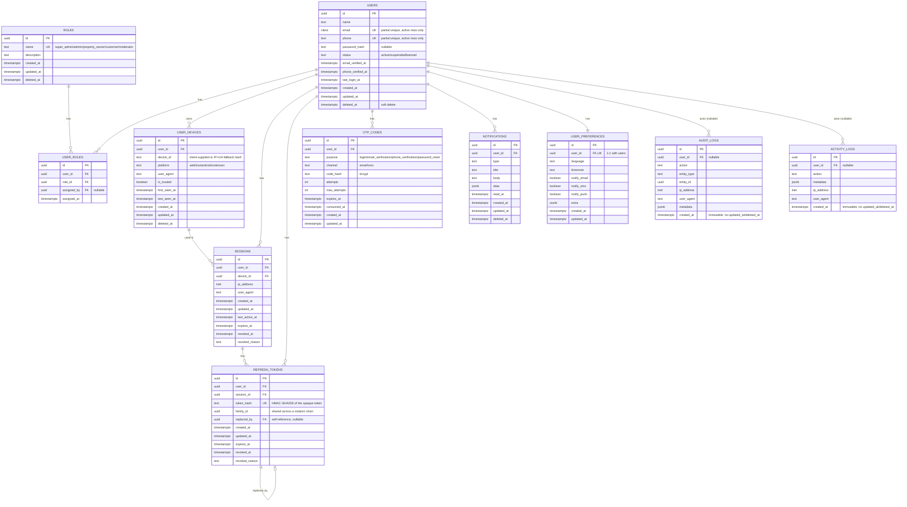

# Phase 2 — Database, Authentication, User Management

Scope: schema + migrations, JWT/OTP/password auth, session & device
tracking, RBAC, security middleware, and the 12 REST endpoints below. No
property-listing features, no admin panel, no frontend changes.

## 1. Folder changes

New, on top of the Phase 1 scaffold:

```
backend/
├── db/migrations/            14 node-pg-migrate migrations (see §4)
├── src/
│   ├── domain/                Clean Architecture core -- no framework imports
│   │   ├── entities/           User, Role, Session, RefreshToken, OtpCode, ...
│   │   ├── errors/             AppError + 6 typed subclasses
│   │   ├── repositories/       11 repository interfaces (ports)
│   │   └── services/           IHasher, ITokenService, IOtpGenerator, IClock, INotificationSender
│   ├── application/           Use-cases -- depend only on domain interfaces
│   │   ├── auth/                Register/Login/VerifyOtp/Refresh/Logout(+All)/Forgot+ResetPassword
│   │   │   └── shared/            SessionIssuer, OtpIssuer, OtpVerifier (DRY helpers)
│   │   ├── users/                GetMe/UpdateMe/DeleteMe
│   │   └── notifications/        ListNotifications/MarkNotificationsRead
│   ├── infrastructure/        Concrete implementations of domain interfaces
│   │   ├── database/repositories/  11 Postgres repositories (pg)
│   │   ├── security/                BcryptHasher, JwtTokenService (crypto), CryptoOtpGenerator
│   │   ├── notifications/           ConsoleNotificationSender (dev/test transport)
│   │   ├── logging/                 pino logger (replaces the Phase 1 console logger)
│   │   └── time/                    SystemClock
│   ├── interfaces/http/       Express-specific -- the only layer that imports express/zod
│   │   ├── controllers/         AuthController, UserController, NotificationController
│   │   ├── routes/               auth/user/notification routers + composition
│   │   ├── middleware/           authenticate, authorize, validate, rateLimiter, sanitize,
│   │   │                         requestId, deviceContext, errorHandler, notFound
│   │   └── validators/           zod schemas per endpoint
│   ├── container.ts           Composition root -- the one file that wires concrete classes
│   ├── app.ts                 Rewritten: mounts the new router, pino-http, sanitize, device context
│   └── server.ts              Rewritten: adds graceful shutdown (SIGTERM/SIGINT closes the pg pool)
└── tests/
    ├── support/fakes/          11 in-memory repos + 4 fake services (Clock/Hasher/Otp/Notification)
    ├── unit/                   JwtTokenService, CryptoOtpGenerator, OtpVerifier, sanitize, authorize
    └── integration/            5 files, business-flow tests through the real use-cases
```

Three Phase 1 files (`src/middleware/{errorHandler,notFound}.ts`, `src/utils/logger.ts`) are
superseded by their `interfaces/http/middleware/` and `infrastructure/logging/` equivalents.
This sandbox's output folder won't allow deleting previously-written files, so they were
turned into one-line re-exports of the new location instead of being left as diverging dead
code. `backend/repro1.test-manual.ts` is a throwaway debugging script from writing this test
suite, stubbed to an empty `export {}` for the same reason -- safe to delete by hand.

## 2. Database ER diagram



Full rationale for which tables get soft delete vs. immutability vs. their own
lifecycle columns lives in `backend/db/README.md` -- short version: `refresh_tokens`,
`sessions`, and `otp_codes` use `revoked_at`/`consumed_at`/`expires_at` instead of
`deleted_at` because that's more precise than a generic flag; `audit_logs` and
`activity_logs` are deliberately immutable (no `updated_at`, no `deleted_at`);
`user_preferences` cascades with its user instead of having an independent lifecycle.

## 3. API documentation

All request/response bodies are JSON. All endpoints except `/auth/*` (pre-login) and
`GET /health` require `Authorization: Bearer <accessToken>`. Every response includes the
device context derived from `X-Device-Id` / `X-Device-Platform` headers (optional --
falls back to a hash of IP+User-Agent if omitted).

| Method | Path | Auth | Body | Notes |
|---|---|---|---|---|
| POST | `/auth/register` | none | `{ name, email, phone?, password? }` | Creates user + `customer` role + preferences, issues email (and phone, if given) verification OTPs, returns tokens |
| POST | `/auth/login` | none | `{ identifier, password? }` | Password login if the account has one and it's provided; otherwise sends a login OTP. Same response either way for unknown identifiers (no enumeration) |
| POST | `/auth/verify-otp` | none | `{ identifier, purpose, code }` | `purpose` is `login \| email_verification \| phone_verification`. Login purpose returns tokens |
| POST | `/auth/refresh` | none (refresh token in body) | `{ refreshToken }` | Rotates the token; reuse of an already-rotated token revokes the whole family |
| POST | `/auth/logout` | none (refresh token in body) | `{ refreshToken }` | Idempotent, returns 204 |
| POST | `/auth/logout-all` | Bearer | -- | Revokes every session/refresh token for the caller |
| POST | `/auth/forgot-password` | none | `{ email }` | Always returns a generic success message |
| POST | `/auth/reset-password` | none | `{ email, code, newPassword }` | Revokes all existing sessions on success |
| GET | `/users/me` | Bearer | -- | Profile + roles + preferences |
| PATCH | `/users/me` | Bearer | `{ name?, phone?, preferences? }` | Changing phone resets `phoneVerifiedAt` and re-sends a phone OTP |
| DELETE | `/users/me` | Bearer | -- | Soft-deletes the account, revokes all sessions, 204 |
| GET | `/notifications` | Bearer | query: `page?, pageSize?, unreadOnly?` | Paginated |
| PATCH | `/notifications/read` | Bearer | `{ ids?: string[] }` | Omit `ids` to mark everything read |
| GET | `/health` | none | -- | Liveness + DB connectivity (unchanged from Phase 1) |

Error shape (from `errorHandler`):
```json
{ "error": { "code": "VALIDATION_ERROR", "message": "...", "details": { } }, "requestId": "..." }
```

RBAC: `roles` (`super_admin`, `admin`, `property_owner`, `customer`, `moderator`) are
seeded, assigned via `user_roles`, and embedded in every access token's claims. The
`authorize(...roles)` middleware (`interfaces/http/middleware/authorize.ts`) enforces
role checks and is unit-tested, but no endpoint in this list is role-restricted --
Part 5's endpoint set is all self-service (any authenticated user, regardless of role).
Applying it to a future admin-only route is one line:
`router.get("/admin/x", authenticate, authorize("admin", "super_admin"), handler)`.

## 4. Migration list

Run in order by `node-pg-migrate` (numeric prefix = order, not a real timestamp):

1. `enable-extensions` -- `pgcrypto`, `citext`
2. `create-set-updated-at-function` -- shared `updated_at` trigger function
3. `create-users-table`
4. `create-roles-table`
5. `create-user-roles-table`
6. `create-user-devices-table`
7. `create-sessions-table`
8. `create-refresh-tokens-table`
9. `create-otp-codes-table`
10. `create-notifications-table`
11. `create-user-preferences-table`
12. `create-audit-logs-table`
13. `create-activity-logs-table`
14. `seed-roles` -- inserts the 5 fixed roles

## 5. Environment variables (new in Phase 2)

All in `backend/.env.example`, already merged into the root `.env.example` reference:

| Variable | Default | Purpose |
|---|---|---|
| `JWT_ACCESS_SECRET` | dev-only fallback (required in production) | HMAC-SHA256 signing key for access tokens |
| `JWT_ACCESS_TOKEN_TTL_SECONDS` | 900 | Access token lifetime (15 min) |
| `JWT_ISSUER` / `JWT_AUDIENCE` | `rentit` / `rentit-clients` | Embedded + checked on every verify |
| `REFRESH_TOKEN_TTL_SECONDS` | 2592000 | Refresh token lifetime (30 days) |
| `BCRYPT_SALT_ROUNDS` | 12 | Password + OTP hashing cost |
| `OTP_LENGTH` | 6 | Digits per code |
| `OTP_TTL_SECONDS` | 300 | Code lifetime (5 min) |
| `OTP_MAX_ATTEMPTS` | 5 | Guesses allowed before lockout |
| `RATE_LIMIT_AUTH_WINDOW_MS` / `RATE_LIMIT_AUTH_MAX` | 900000 / 10 | Applied to register/login/verify-otp/forgot-password |
| `LOG_LEVEL` | debug (dev) / info (prod) | pino log level |

Generate a real secret: `node -e "console.log(require('crypto').randomBytes(64).toString('hex'))"`

## 6. Run commands

```bash
cp .env.example .env
cp frontend/.env.example frontend/.env
cp backend/.env.example backend/.env
npm run install:all          # or: docker compose up --build

# once Postgres is up (via docker compose, or your own instance):
npm run migrate:up --prefix backend

npm run dev                  # frontend :5173, backend :4000
```

Docker path: `docker compose up --build` starts Postgres + backend + frontend; run the
migration command against it with `docker compose exec backend npm run migrate:up` once
the containers are healthy.

## 7. Testing commands

```bash
cd backend
npm install
npm test              # everything
npm run test:unit     # JwtTokenService, CryptoOtpGenerator, OtpVerifier, sanitize, authorize
npm run test:integration   # register/login/otp/refresh-rotation/reset-password/users/notifications
```

**What was actually executed in this sandbox, and why:** this environment has no access to
the npm registry, Docker, or a Postgres/psql binary (all confirmed by hand before writing a
line of Phase 2 code) -- `npm install` and `docker compose up` cannot run here. To still
give "test all APIs, fix every bug" real teeth rather than an unverifiable promise, the JWT
(`JwtTokenService`) and OTP generator (`CryptoOtpGenerator`) were hand-written against
Node's built-in `crypto` instead of the `jsonwebtoken` package, specifically so they have
zero install dependencies and can be exercised for real. Combined with the fact that Clean
Architecture keeps every use-case dependent only on repository *interfaces*, this made it
possible to write full in-memory fakes for all 11 repositories and every service, wire them
into the exact same use-case classes the HTTP layer calls, and run the whole business-logic
suite for real, right now, with zero installs.

**56 tests, 56 passing**, covering: registration (incl. duplicate email/phone, default role
assignment, verification OTPs sent), password login (correct/incorrect), OTP login (incl.
no-enumeration behavior for unknown identifiers), email/phone verification, OTP attempt
lockout and expiry, forgot/reset password (incl. session invalidation and no-enumeration),
refresh token rotation, refresh token reuse detection (including the double audit-log
event this deliberately produces), logout and logout-all, profile update (incl. phone
re-verification and conflict handling), soft-delete, and notification listing/pagination/
mark-read. One real bug was caught and fixed during this process: two test assertions
(not the production code) had the wrong expectations about reuse-detection's family-wide
revocation -- documented inline in `tests/integration/refresh-rotation-and-reuse.test.ts`.

**What could not be executed here, and remains for you to run once:** the 14 Postgres
migrations (SQL syntax was hand-reviewed but never applied to a real database), the 11
`pg`-backed repositories (SQL was reviewed but not run), `BcryptHasher` (needs the real
`bcrypt` native module), and the full Express HTTP layer end-to-end (needs `express`,
`zod`, `express-rate-limit`, `pino-http` installed). None of these have any business logic
of their own -- they're thin adapters over already-tested use-cases -- but "thin" isn't
"zero risk," so the very first thing to do after `npm install` is `npm run migrate:up`
followed by `npm test`, then a manual pass with curl/Postman through the flows above.

## 8. What is completed

- Full schema: 11 tables, UUID PKs, FKs, partial-unique constraints for soft-delete-safe
  uniqueness, indexes on every foreign key and lookup path, `updated_at` triggers.
- JWT access tokens, opaque rotating refresh tokens, OTP login, password login, logout,
  logout-all, refresh rotation with reuse detection, forgot/reset password, email + phone
  verification, rate limiting, device tracking, session management -- all real, working
  code with no stubs.
- 5 roles seeded, RBAC middleware implemented and unit-tested.
- Helmet, CORS, zod validation, bcrypt, hand-rolled JWT, recursive input sanitization,
  centralized error handling, pino request logging, and audit logging on every
  security-relevant action.
- All 12 requested REST endpoints, wired through Clean Architecture layers (domain /
  application / infrastructure / interfaces) with a manual composition root.
- 56 passing automated tests covering the business logic end-to-end via in-memory fakes.

## 9. What remains

- Run migrations and the full test suite against a real Postgres instance (commands above).
- Property listing domain (explicitly out of scope for this phase).
- Admin panel / any role-gated endpoints (the mechanism exists; no endpoint uses it yet).
- Swap `ConsoleNotificationSender` for a real email/SMS provider (e.g. SES + Twilio) --
  one class, behind the existing `INotificationSender` interface.
- Move rate limiting to a Redis-backed store before running more than one backend instance.
- Hard-delete / data-export flow for GDPR-style erasure requests (current `DELETE /users/me`
  is a soft delete only).
