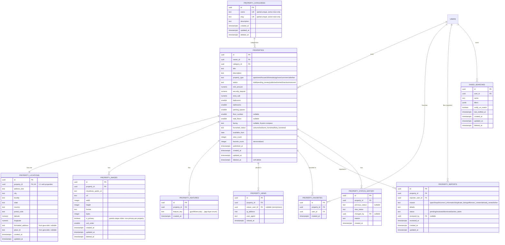

# Phase 3 — Property Marketplace

Scope: production-ready property listings -- schema, API, search, image
upload (Cloudinary), maps (Google Geocoding + Haversine radius search), and
the React frontend pages for all of the above. No admin panel, no
payments (both explicitly deferred to a later phase).

## 1. Folder changes

New, on top of Phase 1 (scaffold) and Phase 2 (auth/users):

```
backend/
├── db/migrations/                     11 new migrations, 015-025 (see §4)
├── src/
│   ├── domain/
│   │   ├── entities/                    Property, PropertyCategory, PropertyLocation,
│   │   │                                 PropertyImage, PropertyFeature, PropertyView,
│   │   │                                 PropertyFavorite, PropertyReport,
│   │   │                                 PropertyStatusHistory, SavedSearch
│   │   ├── repositories/                9 new repository interfaces (ports)
│   │   └── services/                    IImageStorageService, IGeocodingService (new ports)
│   ├── application/properties/
│   │   ├── shared/                       PropertyDetailLoader, PropertyDetailDTO,
│   │   │                                 authorization.ts (assertOwnerOrAdmin), haversine.ts
│   │   └── *.usecase.ts                  13 use-cases: Create/Get/Search/Update/Delete
│   │                                     Property, Upload/DeletePropertyImage,
│   │                                     Favorite/UnfavoriteProperty, ReportProperty,
│   │                                     GetMyProperties, GetMyFavorites,
│   │                                     ListPropertyCategories (see note in §3)
│   ├── infrastructure/
│   │   ├── database/repositories/        9 new Postgres repositories
│   │   ├── database/buildPropertySearchQuery.ts   pure SQL-builder, unit-tested standalone
│   │   ├── storage/CloudinaryImageStorageService.ts
│   │   └── maps/GoogleGeocodingService.ts
│   └── interfaces/http/
│       ├── controllers/PropertyController.ts
│       ├── routes/property.routes.ts
│       ├── middleware/imageUpload.ts      multer wrapper -> ValidationError on bad input
│       ├── middleware/optionalAuthenticate.ts   attaches req.user if a valid token is present, else anonymous
│       └── validators/property.schemas.ts
└── tests/
    ├── support/fakes/                    9 new in-memory property repos + Fake Cloudinary/Geocoding
    ├── support/buildPropertyTestContainer.ts
    ├── unit/haversine.test.ts, buildPropertySearchQuery.test.ts
    └── integration/properties-crud.test.ts, properties-search.test.ts, properties-images.test.ts

frontend/
├── src/api/                              httpClient.ts (fetch wrapper + silent refresh),
│                                          tokenStore.ts, auth.ts, properties.ts, types.ts
├── src/context/AuthContext.tsx
├── src/hooks/useAsync.ts
├── src/components/                       Layout, PropertyCard, PropertyForm,
│                                          ImageGallery, ImageUploadManager, AuthPanel,
│                                          RequireAuth, Pagination, EmptyState, ErrorState,
│                                          Skeletons
└── src/pages/                             Home, Search, PropertyDetails, AddProperty,
                                           EditProperty, MyProperties, Favorites, NotFound
```

`frontend/src/App.css` (Phase 1 boilerplate) is superseded by `index.css` and the new
component/page styles; it's no longer imported anywhere. As in Phase 1/2, this sandbox's
output folder won't allow deleting previously-written files, so it's left in place, unused,
rather than turned into dead code that's still wired up. One stray nested folder,
`backend/backend/`, was created by a path mistake mid-session and is likewise harmless,
unused clutter for the same reason (files here can't be deleted once written).

**A note on scope vs. the literal endpoint list:** `GET /properties/categories` was added
beyond Part 2's 12 listed endpoints. It's necessary supporting plumbing, not a new feature --
the Add/Edit Property forms and the Search page's Category filter both need real category
IDs, and those are only known once migrations have run (they're not predictable client-side
constants). This mirrors how Part 6's "Current Location" was implicitly a
frontend/browser-geolocation concern rather than a new backend endpoint.

## 2. Database ER diagram (all 21 tables)

Phase 2's 11 tables (`users` through `activity_logs`) are unchanged -- see `docs/phase-2.md`
§2 for their diagram. Phase 3 adds 10 more, all hanging off `properties`:



Each table's soft-delete-vs-immutable-vs-cascading choice follows the exact conventions
established in Phase 2 (documented in `backend/db/README.md`): `property_locations` cascades
with its property like `user_preferences` did with its user; `property_features` and
`property_favorites` are toggle tables (insert/delete, no soft delete) like `user_roles`;
`property_views` and `property_status_history` are immutable event logs like
`audit_logs`/`activity_logs`; `property_reports` is a moderation record with its own
`status` column instead of soft delete, since deleting a report shouldn't erase the fact it
was filed.

## 3. API documentation

All 12 originally-requested endpoints, plus `GET /properties/categories` (see the scope
note in §1). `Auth: optional` means `optionalAuthenticate` -- the request works either way,
but an authenticated caller gets extra fields (`isFavorited`) or extra visibility (their own
unpublished listings).

| Method | Path | Auth | Body / Query | Notes |
|---|---|---|---|---|
| POST | `/properties` | Bearer (`property_owner`\|`admin`\|`super_admin`) | full property + `location` object | Creates as `status: "draft"`, geocodes the address if lat/lng aren't given, records status history |
| GET | `/properties` | none | query: all filters/sort/pagination (see below) | Only `published`, non-deleted listings; bulk-fetches location/image/category to avoid N+1 |
| GET | `/properties/:id` | optional | -- | 404 (not 403) for a non-published listing unless you're the owner/admin; dedups view-count increments per viewer for 30 minutes |
| PATCH | `/properties/:id` | Bearer (owner or admin) | any subset of fields | Re-geocodes only if the address changed and no explicit lat/lng was given; records status history on status change |
| DELETE | `/properties/:id` | Bearer (owner or admin) | -- | Soft delete, records a `removed` status history entry, 204 |
| POST | `/properties/:id/images` | Bearer (owner or admin) | multipart `images` (up to 10 total) | Uploads to Cloudinary with resize/compress transformations; first image on an empty listing becomes primary |
| DELETE | `/properties/:id/images/:imageId` | Bearer (owner or admin) | -- | Destroys the Cloudinary asset too; auto-promotes the next image (by sort order) if the primary was deleted |
| POST | `/properties/:id/favorite` | Bearer | -- | Idempotent, maintains the denormalized `favorite_count` |
| DELETE | `/properties/:id/favorite` | Bearer | -- | Idempotent |
| POST | `/properties/:id/report` | Bearer | `{ reason, details? }` | One report per user per property (409 on repeat) |
| GET | `/properties/mine` | Bearer | query: `page?, pageSize?` | Every listing you own, any status, paginated |
| GET | `/properties/favorites` | Bearer | query: `page?, pageSize?` | Your favorited listings, most-recently-favorited first |
| GET | `/properties/categories` | none | -- | *Not in the original 12* -- see §1 |

**Search filters** (`GET /properties` query params): `category` (slug), `propertyType`,
`rentMin`/`rentMax`, `bedroomsMin`, `bathroomsMin`, `parkingMin`, `areaMin`/`areaMax`, `city`
(substring match), `locality` (substring match), `furnished`, `availableFrom` (listings
available on or before this date), `lat`/`lng`/`radiusKm` (nearby/radius search), `sort`
(`newest` \| `most_viewed` \| `price_low_to_high` \| `price_high_to_low`, default `newest`),
`page`/`pageSize` (default 1/20, max page size 50).

Response shape for `GET /properties`, `/properties/mine`, `/properties/favorites`:
`{ items, total, page, pageSize }`. A single property (create/get/update) returns the full
detail DTO directly (title, description, all numeric fields, `category`, `owner`,
`location`, `images[]`, `features[]`, `isFavorited`, `distanceKm`).

Error shape is unchanged from Phase 2:
```json
{ "error": { "code": "VALIDATION_ERROR", "message": "...", "details": {} }, "requestId": "..." }
```

## 4. Migration list

Continuing Phase 2's numbering (14 existing migrations, these are 015-025):

15. `create-property-categories-table`
16. `create-properties-table` -- the core listing table, all CHECK constraints inline
17. `create-property-locations-table` -- 1:1, lat/lng index for radius search
18. `create-property-images-table` -- partial unique index (one primary per property) + a
    `BEFORE INSERT` trigger backstopping the 10-image maximum at the DB level
19. `create-property-features-table` -- toggle table, `UNIQUE (property_id, feature_key)`
20. `create-property-views-table` -- immutable, indexed for the 30-minute view-dedup lookup
21. `create-property-favorites-table` -- toggle table, `UNIQUE (property_id, user_id)`
22. `create-property-reports-table` -- `UNIQUE (property_id, reporter_user_id)` (one report per user)
23. `create-property-status-history-table` -- immutable
24. `create-saved-searches-table` -- filters stored as `jsonb`; not exposed via any endpoint
    yet (no Part 2 endpoint requested it) -- schema exists for a future "notify me" feature
25. `seed-property-categories` -- 4 categories: Residential Rental, Commercial Rental,
    PG / Hostel, Vacation Rental

## 5. Cloudinary setup

1. Create a free account at cloudinary.com.
2. From the dashboard's "Account Details" panel, copy the Cloud Name, API Key, and API
   Secret into `backend/.env`:
   ```
   CLOUDINARY_CLOUD_NAME=your-cloud-name
   CLOUDINARY_API_KEY=your-api-key
   CLOUDINARY_API_SECRET=your-api-secret
   MAX_IMAGE_UPLOAD_BYTES=10485760
   ```
3. No bucket/preset configuration is required -- `CloudinaryImageStorageService` uploads via
   `upload_stream` with an inline transformation (`width/height <= 2000, crop: limit`,
   `quality: auto`, `fetch_format: auto`), which is how resize/compression is implemented:
   at upload time, not with a separate image-processing library.
4. Images upload to a `properties/<propertyId>/` folder per listing; deleting an image calls
   `cloudinary.uploader.destroy` with the stored `cloudinary_public_id`, so nothing is
   orphaned in your Cloudinary media library.

## 6. Google Maps setup

1. In Google Cloud Console, create (or reuse) a project and enable the **Geocoding API**.
2. Create an API key under Credentials and (recommended) restrict it to the Geocoding API.
3. Add it to `backend/.env`:
   ```
   GOOGLE_MAPS_API_KEY=your-api-key
   ```
4. `GoogleGeocodingService` calls `https://maps.googleapis.com/maps/api/geocode/json` via
   the native `fetch` API (no SDK dependency) whenever a property is created/updated with an
   address but no explicit latitude/longitude.
5. "Nearby search" / "radius search" / "distance calculation" don't need any Google Maps
   *API* calls at request time -- they're computed from the stored lat/lng using a
   bounding-box pre-filter plus an exact Haversine distance calculation (see
   `application/properties/shared/haversine.ts` and
   `infrastructure/database/buildPropertySearchQuery.ts`). "Current location" is a
   browser-geolocation feature (`navigator.geolocation`), implemented in the frontend's
   Search page and Add/Edit Property forms -- there's nothing for the backend to do there.

## 7. Run commands

```bash
cp backend/.env.example backend/.env      # then fill in Cloudinary + Google Maps keys
cp frontend/.env.example frontend/.env
npm run install:all                       # or: docker compose up --build

npm run migrate:up --prefix backend       # adds migrations 015-025 on top of Phase 2's 14

npm run dev                               # frontend :5173, backend :4000
```

Nothing about the Phase 1/2 run flow changes -- Cloudinary/Google Maps keys are the only new
required setup, and both gracefully degrade to empty-string config (not a crash) if unset,
so the app still boots for local development; image upload and address geocoding will fail
with a clear error until real keys are provided.

## 8. Testing commands

```bash
cd backend
npm install
npm test                    # everything, Phase 2 + Phase 3
npm run test:unit           # + haversine.test.ts, buildPropertySearchQuery.test.ts
npm run test:integration    # + properties-crud/-search/-images.test.ts
```

**What was actually executed in this sandbox, and why:** the same constraints as Phase 1/2
apply (no npm registry, no Docker, no Postgres binary -- confirmed again before writing
Phase 3 code). The same strategy that made Phase 2 fully testable without installs carries
over directly: `buildPropertySearchQuery` and `haversine`/`boundingBox` were extracted as
pure, dependency-free functions specifically so they could be unit-tested with zero
installs, and Clean Architecture's dependency-inversion meant writing 9 new in-memory
repository fakes plus fake Cloudinary/Geocoding services was enough to run every property
use-case for real, through the exact same classes the HTTP layer calls.

**95 tests, 95 passing** (56 from Phase 2 unchanged + 39 new):
- `haversine.test.ts` (7): distance correctness against known city pairs (NYC-LA ≈3936km,
  London-Paris ≈344km), symmetry, and bounding-box containment.
- `buildPropertySearchQuery.test.ts` (6): correct SQL + positional parameter indexing for
  no-filter, paginated, every sort option, simple filters, a complex multi-filter + radius
  combination, and the case where radius search is correctly *omitted* when only some of
  lat/lng/radius are given.
- `properties-crud.test.ts` (10): create (incl. auto-geocoding when no lat/lng given),
  category-not-found, get (404-not-403 for unpublished listings viewed by non-owners,
  30-minute view-count dedup), update (field changes, status-change history, re-geocode
  logic, ownership enforcement, admin override), delete (soft delete + history + re-delete
  404).
- `properties-search.test.ts` (8): excludes unpublished/deleted listings, numeric/enum
  filters, case-insensitive city substring match, unknown-category-slug returns empty
  (not an error), every sort order, pagination non-overlap, radius search distance
  filtering, and category-name/primary-image joins in results.
- `properties-images.test.ts` (8): first-image-becomes-primary, the 10-image cap (including
  the exact boundary), empty-upload and non-owner rejections, auto-promotion of the next
  image when the primary is deleted, cross-property image 404, favorite/unfavorite
  idempotency and denormalized count maintenance, duplicate-report conflict, and
  my-properties/my-favorites scoping + pagination.

One self-caught bug during development (not user-reported): `PropertyRepository.search()`'s
radius-search branch initially built its bounding-box condition with a confusing
push-then-undo sequence; it was refactored into the standalone, unit-tested
`buildPropertySearchQuery()` function instead. `imageUpload.ts`'s `fileFilter` initially
threw a plain `Error` for a bad mimetype, which would have produced a generic 500 instead of
a 400 -- caught before wiring it into routes and rewritten to convert multer's errors into
`ValidationError`.

**What could not be executed here, and remains for you to run once:** the 11 new Postgres
migrations (SQL hand-reviewed, never applied to a live database), the 9 new `pg`-backed
repositories, `CloudinaryImageStorageService` and `GoogleGeocodingService` (both need real
network access + API keys), the full Express HTTP layer end-to-end, and the entire React
frontend (needs `npm install` for `react-router-dom` and a running backend to talk to). The
frontend has no automated test suite of its own in this phase -- no JS test runner
(Vitest/Jest) is installable in this sandbox either, so rather than fabricate a test file
that was never executed, this is disclosed here directly: after `npm install`, a manual pass
through Home -> Search -> Property Details -> (sign in) -> List a property -> upload
photos -> Edit -> My Properties -> Favorites -> 404 is the recommended first check, followed
by wiring up a real component-test runner if the project continues.

## 9. What is completed

- Full property schema: 10 tables, all indexes/FKs/constraints/soft-delete conventions
  consistent with Phase 2.
- All 12 requested REST endpoints (+ `GET /properties/categories`, see §1), through Clean
  Architecture layers, wired in `container.ts`.
- Production search: every listed filter, all 4 sort orders, pagination, and radius/nearby
  search via bounding-box + exact Haversine distance -- no PostGIS dependency.
- Every Part 4 property-detail field, including the owner's public info, category, image
  gallery, features, map location, and a view counter with per-viewer dedup.
- Cloudinary image upload with resize/compression transformations, a 10-image cap enforced
  at both the application layer (clean 400) and the database (defense-in-depth trigger),
  and delete/replace (replace = delete + re-upload, using the existing endpoints rather than
  inventing a new one not in Part 2's list).
- Google Geocoding integration for address -> lat/lng, plus nearby/radius search and
  distance calculation; "current location" implemented client-side via
  `navigator.geolocation`.
- Every field validated and every input sanitized via the same zod + `sanitizeBody`
  middleware from Phase 2, extended with Phase 3's schemas.
- 95 passing automated tests (56 Phase 2 + 39 new), all runnable with zero installs via
  in-memory fakes and pure extracted functions.
- A full React frontend: Home, Search (with every filter + sort + nearby), Property Details
  (gallery, stats, features, map link, favorite/report), Add Property (form + inline image
  upload), Edit Property (form + image management + status control), My Properties,
  Favorites, and a 404 page -- with shared loading skeletons, empty states, error states with
  retry, and responsive layouts (single-column below 900px), built from reusable components
  (`PropertyCard`, `Pagination`, `EmptyState`, `ErrorState`, skeletons, `AuthPanel`).

## 10. What remains

- Run migrations 015-025 and the full test suite against a real Postgres instance.
- `npm install` the frontend (adds `react-router-dom`) and do a manual click-through; add a
  component test runner (Vitest is the natural fit alongside Vite) if frontend automated
  tests are wanted going forward.
- Provide real Cloudinary and Google Maps API keys to exercise image upload and geocoding
  end-to-end (both are stubbed-safe -- the app boots without them, but those two features
  will error until configured).
- `saved_searches` has a schema and repository-shaped need but no endpoint yet -- a natural
  Phase 4+ feature ("notify me when a matching listing appears").
- Admin panel and payments, as explicitly scoped out of Phase 3.
- The frontend's login is OTP-first (matching Phase 2's backend design) with the OTP code
  currently only visible in the *backend's* console/logs, because `ConsoleNotificationSender`
  (Phase 2) is still the notification transport -- no real email/SMS provider is wired up
  yet. Swapping it for a real provider (Phase 2's §9 already flagged this) will make the login
  flow usable end-to-end without reading server logs.
