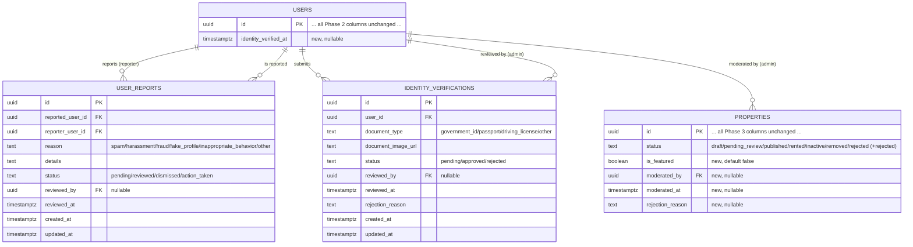

# Phase 4 — Admin Panel, Moderation, and Production Operations

Scope: a production-grade admin panel over everything Phase 2/3 built --
dashboard/analytics, user management, property moderation, report handling,
owner verification, broadcast notifications, audit logging -- plus the
React admin application to drive all of it. Payments and Chat are
explicitly out of scope for this phase, per the brief.

## 1. Folder changes

New, on top of Phase 1 (scaffold), Phase 2 (auth/users), and Phase 3
(property marketplace):

```
backend/
├── db/migrations/                     4 new migrations, 026-029 (see §4)
├── src/
│   ├── domain/
│   │   ├── entities/                    UserReport, IdentityVerification (new);
│   │   │                                 Property (+status "rejected", isFeatured,
│   │   │                                 moderatedBy, moderatedAt, rejectionReason);
│   │   │                                 User (+identityVerifiedAt)
│   │   ├── repositories/                IUserReportRepository, IIdentityVerificationRepository,
│   │   │                                 IAdminAnalyticsRepository (new); IUserRepository,
│   │   │                                 IPropertyRepository, IPropertyStatusHistoryRepository,
│   │   │                                 IPropertyReportRepository, IActivityLogRepository,
│   │   │                                 IAuditLogRepository (all additively extended)
│   │   └── services/                    IPushNotificationService, IHealthCheckService (new ports)
│   ├── application/
│   │   ├── admin/shared/adminGuards.ts   assertCanModerateUser -- shared privilege-escalation guard
│   │   ├── admin/users/                  7 use-cases (search, profile, status, delete,
│   │   │                                 reset-password, roles, activity)
│   │   ├── admin/properties/             9 use-cases (search, approve, reject, hide,
│   │   │                                 unhide, feature, unfeature, bulk-moderate,
│   │   │                                 moderation-history)
│   │   ├── admin/reports/                4 use-cases (list/update property reports,
│   │   │                                 list/update user reports)
│   │   ├── admin/verification/           3 use-cases (list, approve, reject)
│   │   ├── admin/notifications/          BroadcastNotification.usecase.ts
│   │   ├── admin/analytics/              3 use-cases (dashboard stats, growth, top properties)
│   │   ├── admin/audit/                  SearchAuditLogs.usecase.ts
│   │   ├── admin/system/                 GetSystemHealth.usecase.ts
│   │   ├── users/ReportUser.usecase.ts   self-service "report a user" (mirrors ReportProperty)
│   │   └── verification/                 SubmitIdentityVerification, GetMyVerificationStatus
│   │                                      (self-service half of Part 5)
│   ├── infrastructure/
│   │   ├── database/repositories/        UserReportRepository, IdentityVerificationRepository,
│   │   │                                 AdminAnalyticsRepository (new); UserRepository,
│   │   │                                 PropertyRepository, PropertyStatusHistoryRepository,
│   │   │                                 PropertyReportRepository, ActivityLogRepository,
│   │   │                                 AuditLogRepository (all extended)
│   │   ├── database/buildAdminPropertySearchQuery.ts   admin-only query builder (any status)
│   │   ├── database/PostgresHealthCheckService.ts
│   │   └── notifications/ConsolePushNotificationService.ts
│   └── interfaces/http/
│       ├── controllers/                  AdminUserController, AdminPropertyController,
│       │                                 AdminReportController, AdminVerificationController,
│       │                                 AdminNotificationController, AdminDashboardController,
│       │                                 AdminAuditController, VerificationController (new);
│       │                                 UserController (+report method)
│       ├── routes/admin.routes.ts        every /admin/* route, authenticate + authorize
│       │                                 ("admin","super_admin") applied once at the router level
│       ├── routes/verification.routes.ts self-service /verification/*
│       ├── middleware/imageUpload.ts     (+uploadSingleImage, for verification documents)
│       └── validators/admin.schemas.ts   every admin/verification zod schema
└── tests/
    ├── support/fakes/                    UserReport, IdentityVerification, AdminAnalytics
    │                                      in-memory fakes; FakePushNotificationService,
    │                                      FakeHealthCheckService (new); Activity/Audit/
    │                                      PropertyReport/Property fakes extended
    ├── support/buildAdminTestContainer.ts
    ├── unit/adminGuards.test.ts
    └── integration/admin-users.test.ts, admin-properties.test.ts,
        admin-reports-and-verification.test.ts,
        admin-notifications-analytics-system.test.ts

frontend/
├── src/api/admin.ts, verification.ts     admin + self-service verification API clients
├── src/context/ThemeContext.tsx          light/dark mode, data-theme attribute + localStorage
├── src/components/RequireAdmin.tsx
├── src/components/admin/                 AdminLayout (sidebar + topbar), AdminCharts
│                                         (dependency-free SVG line/bar charts), AdminWidgets
│                                         (StatCard, QuickActionCard, AdminPanel, StatusPill)
└── src/pages/
    ├── VerificationStatusPage.tsx         self-service verification (any signed-in user)
    └── admin/                             Dashboard, Users, UserDetail, Properties,
                                           PropertyModerationHistory, Reports, Verification,
                                           Notifications, Analytics, AuditLogs
```

**Design principle carried through this whole phase: reuse aggressively.**
Several Part 3/4 bullet points are the *same* underlying operation with a
different parameter, not separate features:

- "Delete Property" (Part 3) reuses Phase 3's existing `DeletePropertyUseCase`
  unchanged (it already allows an admin via `assertOwnerOrAdmin`).
- "Pending/Approved/Rejected/Hidden/Featured Properties" (Part 3) are one
  `AdminSearchPropertiesUseCase` with a different `status`/`isFeatured` filter.
- "Suspend User", "Activate User" (Part 2), and "Ban User" (Part 4) are one
  `UpdateUserStatusUseCase` with a different target status.
- "Hide Listing" (Part 4) is the exact same `HidePropertyUseCase` Part 3 uses
  for "Hidden Properties."
- "Resolve Report" / "Dismiss Report" (Part 4) are one status-update
  use-case per report type, not four endpoints.
- "Moderation History" (Part 3) reads directly from Phase 3's existing
  `property_status_history` table -- every approve/reject/hide/unhide
  already wrote a row there; this phase only added the read side.
- "Broadcast Notifications" (Part 6) reuses Phase 2's `notifications` table
  (one row per recipient) -- no new table.
- "Reset Password" (Part 2) triggers the exact same `password_reset` OTP
  flow Phase 2 built for self-service "forgot password," just admin-initiated
  and audit-logged; the admin never sees or sets a plaintext password.

## 2. Database ER diagram (additive changes only)

Phases 1-3's 25 tables (see `docs/phase-2.md` §2 and `docs/phase-3.md` §2)
are unchanged in shape except for the additive columns below. Phase 4 adds
two new tables.



Lifecycle conventions (see `backend/db/README.md` for the full rationale
table): `user_reports` is a structural mirror of Phase 3's `property_reports`
-- a moderation record with its own `status` column, no soft delete.
`identity_verifications` follows the same pattern: a user can resubmit after
rejection (no uniqueness constraint on `user_id`), and "current" status is
simply the most recent row by `created_at DESC`. Both new columns on
`properties`/`users` are nullable and default-safe, so no backfill migration
was needed.

## 3. API documentation

All routes below (except the two self-service `/verification/*` routes and
the self-service `POST /users/:id/report`) are mounted under `/admin` and
gated by `authenticate` + `authorize("admin", "super_admin")`, applied once
at the router level in `admin.routes.ts` -- a new endpoint added later can't
accidentally skip the gate.

**Part 1 — Dashboard & System Health**

| Method | Path | Notes |
|---|---|---|
| GET | `/admin/dashboard/stats` | 14 counters: users by status, properties by status, featured, total views/favorites, pending reports/verifications |
| GET | `/admin/system/health` | DB ping (real `SELECT 1`), uptime, Node version; `503` when the database check fails |

**Part 2 — User Management**

| Method | Path | Body / Query | Notes |
|---|---|---|---|
| GET | `/admin/users` | `query?, status?, role?, page, pageSize` | Search/filter/paginate |
| GET | `/admin/users/:id` | -- | Profile + roles + preferences + property count + last 10 activity entries |
| GET | `/admin/users/:id/activity` | `page, pageSize` | Full paginated activity log |
| PATCH | `/admin/users/:id/status` | `{ status, reason? }` | Backs Suspend/Activate/Ban; blocks self-targeting and plain-admin-vs-super_admin |
| DELETE | `/admin/users/:id` | -- | Soft delete, revokes all sessions |
| POST | `/admin/users/:id/reset-password` | -- | Triggers the password_reset OTP flow; never exposes a plaintext password |
| PUT | `/admin/users/:id/roles` | `{ roleNames: string[] }` | Reconciles to the given full role set; only a super_admin can grant `super_admin` |

**Part 3 — Property Moderation**

| Method | Path | Body / Query | Notes |
|---|---|---|---|
| GET | `/admin/properties` | `status?, categoryId?, ownerId?, isFeatured?, city?, sort, page, pageSize` | Any status (not just published) -- backs Pending/Approved/Rejected/Hidden/Featured with a different filter |
| POST | `/admin/properties/:id/approve` | -- | -> `published`, notifies owner |
| POST | `/admin/properties/:id/reject` | `{ reason }` | -> `rejected`, reason required, notifies owner |
| POST | `/admin/properties/:id/hide` | `{ reason? }` | -> `inactive` ("Hide Listing", Part 4, shares this endpoint) |
| POST | `/admin/properties/:id/unhide` | -- | Only from `inactive` -> `published` |
| POST | `/admin/properties/:id/feature` | -- | Only a `published` listing can be featured |
| POST | `/admin/properties/:id/unfeature` | -- | -- |
| DELETE | `/admin/properties/:id` | -- | *Not a new route* -- reuses Phase 3's existing `DELETE /properties/:id`, which already allows an admin |
| POST | `/admin/properties/bulk-moderate` | `{ propertyIds: string[] (max 100), action, reason? }` | Runs each id through the same single-item use-case; partial-failure tolerant |
| GET | `/admin/properties/:id/moderation-history` | `page, pageSize` | One property's status-change history |
| GET | `/admin/properties/moderation-history` | `page, pageSize` | Admin-wide recent moderation feed (same use-case, no id) |

**Part 4 — Report Management**

| Method | Path | Body / Query | Notes |
|---|---|---|---|
| GET | `/admin/reports/properties` | `status?, page, pageSize` | |
| PATCH | `/admin/reports/properties/:id/status` | `{ status }` | `reviewed`/`action_taken` = resolve, `dismissed` = dismiss |
| GET | `/admin/reports/users` | `status?, page, pageSize` | |
| PATCH | `/admin/reports/users/:id/status` | `{ status }` | |
| POST | `/users/:id/report` | `{ reason, details? }` | *Self-service*, any authenticated user -- reports another user; 409 on duplicate, 400 on self-report |

**Part 5 — Owner Verification**

| Method | Path | Auth | Body | Notes |
|---|---|---|---|---|
| POST | `/verification` | Bearer (any user) | multipart: `documentType`, `document` (image) | Submits an ID document for review; re-submittable after rejection |
| GET | `/verification/status` | Bearer (any user) | -- | `{ emailVerified, phoneVerified, identityVerified, identityVerification }` -- email/phone reuse Phase 2's existing OTP-verified booleans |
| GET | `/admin/verification` | admin | `status?, page, pageSize` | |
| POST | `/admin/verification/:id/approve` | admin | -- | Sets `users.identity_verified_at` |
| POST | `/admin/verification/:id/reject` | admin | `{ reason }` | |

**Part 6 — Notifications**

| Method | Path | Body | Notes |
|---|---|---|---|
| POST | `/admin/notifications/broadcast` | `{ title, body, audience: { role?, status? } }` | One notification row per matching user (capped at 5,000, paged in batches of 500) + a push attempt via `IPushNotificationService` |
| GET/PATCH | `/notifications` | -- | *Not new* -- Phase 2's existing endpoints double as each admin's own "system notifications" inbox |

**Part 7 — Analytics**

| Method | Path | Query | Notes |
|---|---|---|---|
| GET | `/admin/analytics/growth` | `metric: users\|properties\|views\|favorites\|reports, days (1-365)` | Daily counts, zero-filled for days with no activity |
| GET | `/admin/analytics/top-properties` | `metric: most_viewed\|most_favorited, limit (1-50)` | |

**Part 8 — Audit Logs**

| Method | Path | Query | Notes |
|---|---|---|---|
| GET | `/admin/audit-logs` | `userId?, action?, entityType?, entityId?, dateFrom?, dateTo?, page, pageSize, format?` | `format=csv` streams a CSV export instead of JSON (same use-case, larger page size, CSV formatting is a controller/presentation concern) |

Error shape is unchanged from Phase 2/3:
```json
{ "error": { "code": "VALIDATION_ERROR", "message": "...", "details": {} }, "requestId": "..." }
```

## 4. Migration list

Continuing Phase 3's numbering (25 existing migrations), these are 026-029:

26. `add-moderation-columns-to-properties` -- `is_featured`, `moderated_by`, `moderated_at`,
    `rejection_reason`; drops+recreates the `status` CHECK constraint to add `'rejected'`;
    adds `properties_status_idx`, a partial `properties_featured_idx`, `properties_moderated_by_idx`
27. `add-identity-verified-at-to-users` -- single nullable `timestamptz` column
28. `create-user-reports-table` -- structural mirror of `property_reports`;
    `UNIQUE (reported_user_id, reporter_user_id)`, `CHECK (reported_user_id <> reporter_user_id)`
29. `create-identity-verifications-table` -- indexed on `(user_id, created_at DESC)` and `status`

All four are additive and fully reversible (`up`/`down`); none alter or drop existing columns.

## 5. Admin guide

**Getting admin access.** Roles are seeded by Phase 2's `seed-roles` migration
(`super_admin`, `admin`, `property_owner`, `customer`, `moderator`). Grant an
account the `admin` role directly in the database for the very first admin
(`INSERT INTO user_roles ...` or via `psql`), since `PUT /admin/users/:id/roles`
itself requires being an admin already. After that, existing admins can
promote others via the Users page's role editor.

**Daily workflow.** The Dashboard's Quick Actions link straight into the
three queues that need regular attention: pending properties, pending
reports, and pending identity verifications. The sidebar groups everything
else under Moderation / People / Comms & Insights.

**Privilege safety.** A plain `admin` cannot suspend, ban, delete, or change
the roles of a `super_admin` account (`assertCanModerateUser`), and no user
can suspend/ban/delete their own account through the admin endpoints --
both guard against accidental or malicious lockouts.

**Bulk moderation.** Select checkboxes on the Properties page, then choose
an action; rejection asks for a reason (native browser prompt), delete asks
for confirmation. Up to 100 properties per batch; a bad id in the batch is
reported per-item without rolling back the others.

**Broadcasts.** The Notifications page composes a title/body, an audience
status (active/suspended/banned), and an optional role filter. It creates
one in-app notification per matching user and calls the push service --
in this environment, `ConsolePushNotificationService` logs pushes to the
backend console rather than calling a real FCM/APNs provider (no
device-token registration exists yet; see §7).

**Audit trail.** Every admin action above records a row via `IAuditLogRepository`
(actor, action, entity type/id, metadata). The Audit Logs page searches by
actor/action/entity and exports the current filter as CSV.

**Dark mode.** The topbar toggle switches a `data-theme` attribute on
`<html>`; the whole admin panel is built from CSS variables that flip
between a light and dark palette, persisted in `localStorage`.

## 6. Deployment notes

- No new environment variables are required for this phase -- Parts 1-8 use
  only the existing Postgres pool, no new external service.
- `ConsolePushNotificationService` is a real, working implementation of
  `IPushNotificationService` (it's not a mock), but it logs instead of
  calling a real push provider. Swapping in `FcmPushNotificationService` or
  similar means implementing the same interface and changing one binding in
  `container.ts` -- no use-case changes required (Open/Closed principle,
  same pattern as Phase 2's `ConsoleNotificationSender`).
- The admin frontend is served from the same Vite app as the public site
  (routes under `/admin`), not a separate deployment. If you want it on a
  separate subdomain/origin later, `App.tsx`'s `/admin` route tree can be
  extracted into its own Vite entry point without touching any admin page
  component.
- `authorize("admin", "super_admin")` is enforced entirely server-side;
  the frontend's `RequireAdmin` gate is a UX convenience (redirect to an
  explanation instead of a confusing 403), not a security boundary.
- Broadcast notifications cap at 5,000 recipients per call as a safety
  limit for this phase; a mailing-list-scale broadcast system (queued,
  rate-limited, retryable) is a natural Phase 5+ hardening item.

## 7. Coverage summary

```bash
cd backend
npm install
npm test                    # everything: Phase 2 + Phase 3 + Phase 4
```

**126 tests, 126 passing** (95 from Phase 2+3, unchanged + 31 new Phase 4):

- `adminGuards.test.ts` (3): `assertCanModerateUser` allows a plain admin to
  moderate a non-super_admin, blocks a plain admin from moderating a
  super_admin, allows a super_admin to moderate another super_admin.
- `admin-users.test.ts` (9): search by query/status/role; profile 404 +
  shape; suspend + audit log; self-suspend/self-ban rejection; plain-admin-
  vs-super_admin guard; soft-delete + self-delete rejection; password-reset
  OTP issuance without exposing a plaintext password; role reconciliation +
  super_admin-grant guard; activity pagination + unknown-user 404.
- `admin-properties.test.ts` (7): approve (publish + history + notification
  + already-published rejection); reject (blank-reason rejection + fields
  set); hide/unhide (including unhide-when-not-hidden rejection); feature/
  unfeature (draft-cannot-be-featured guard); admin search (status filter +
  most_favorited sort); bulk moderate (partial failure, empty-batch and
  reason-required validation); moderation history (per-property + admin-wide).
- `admin-reports-and-verification.test.ts` (5): report-user (self-report +
  duplicate-report rejection); user-report resolve/dismiss + unknown-id
  404; property-report dismiss; identity verification submit -> list ->
  approve -> `identityVerifiedAt` set; identity verification reject
  (blank-reason rejection) + resubmission after rejection.
- `admin-notifications-analytics-system.test.ts` (7): broadcast to all
  active users (including the actor) + blank-title/body rejection;
  broadcast scoped to a role; dashboard stats aggregation; growth analytics
  validation + zero-filled days; top-properties validation + metric
  sorting; audit log search by action; system health ok-vs-degraded.

All 31 tests run against in-memory fakes (`buildAdminTestContainer.ts`)
exercising the exact same use-case classes the HTTP layer calls -- no
mocking framework, real assertions on real return values and side effects
(audit log entries, notification rows, status-history rows).

**What was actually executed in this sandbox, and why:** the same
constraints as Phases 1-3 apply (no npm registry, no Docker, no Postgres
binary). All 206 backend TypeScript files (`src/`) were syntax-checked via
`ts.transpileModule` after every domain/application/infrastructure/interface
change; the only failure is the pre-existing, harmless crash on
`src/types/express/index.d.ts` (an ambient declaration file `transpileModule`
can't emit output for -- present since Phase 2, not a real error). The 48
frontend TypeScript/TSX files were syntax-checked the same way (with JSX
enabled); the only failure is the equivalent pre-existing crash on
`vite-env.d.ts`.

**What could not be executed here, and remains for you to run once:** the
4 new Postgres migrations (SQL hand-reviewed, never applied to a live
database), the 3 new/extended Postgres repositories against a real
connection, the full Express HTTP layer end-to-end (`/admin/*` and
`/verification/*` routes), and the React admin application in a real
browser -- this sandbox has no installed `node_modules` for the frontend
(no npm registry access, same as Phase 3), so there's no `tsc -b`/`vite
build` run to confirm here. Every admin page was written and manually
reviewed against the exact backend DTO shapes it calls, following the same
conventions (`useAsync`, `Pagination`, `ErrorState`/`EmptyState`) as the
already-working Phase 3 pages, and the dependency-free SVG chart components
were chosen specifically because no charting library is installed and
couldn't be added without network access -- disclosed here rather than
silently left broken or faked.

## 8. What is completed

- Full Phase 4 schema: 2 new tables + 5 additive columns across `properties`/
  `users`, all reversible migrations, zero changes to existing columns.
- All 11 parts of the brief: Dashboard/Analytics/System Health (Part 1),
  full User Management (Part 2), full Property Moderation including bulk
  actions and history (Part 3), Report Management for both properties and
  users (Part 4), Owner Verification self-service + admin review (Part 5,
  phone/email verification reused from Phase 2), Broadcast + System
  Notifications with a real Push Notification Service interface (Part 6),
  5 growth charts + most-viewed/most-favorited (Part 7), searchable +
  exportable Audit Logs tracking every admin action (Part 8).
- A complete Admin React application (Part 9): responsive sidebar + topbar
  layout, dark mode, 10 admin pages, dependency-free SVG charts, tables,
  forms, and bulk-action UI, sharing the existing app's auth/API-client
  conventions.
- 126 passing automated tests (95 Phase 2+3 + 31 new), all runnable with
  zero installs via in-memory fakes.
- Full documentation (this file): updated ER diagram, complete API
  reference, an admin operations guide, deployment notes, and this
  coverage summary.
- Every admin route gated server-side by role; every admin action
  audit-logged; a shared privilege-escalation guard so a plain admin can
  never act on a super_admin account or on their own account destructively.

## 9. What remains

- Run migrations 026-029 and the full test suite against a real Postgres
  instance; smoke-test the admin frontend in a real browser after
  `npm install` (adds nothing new to `package.json` -- no chart library or
  extra dependency was introduced, by design, given this sandbox's
  constraints).
- Wire a real push notification provider (FCM/APNs) behind
  `IPushNotificationService` when device-token registration exists --
  `ConsolePushNotificationService` is a deliberate, disclosed stand-in.
- Consider a queued/rate-limited broadcast pipeline if recipient counts are
  expected to exceed the current 5,000-per-call safety cap.
- Phase 5+: Payments and Chat, both explicitly out of scope here per the
  brief.
